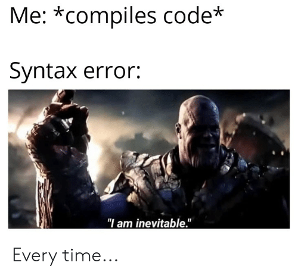

- [Exercise 1: Excel and Snakes](#exercise-1-excel-and-snakes)
  - [Tasks](#tasks)
    - [Accessing data](#accessing-data)
    - [Printing the whole file nicely](#printing-the-whole-file-nicely)
  - [examples](#examples)
- [Exercise 2: Exceptional programming](#exercise-2-exceptional-programming)
  - [Reading error messages](#reading-error-messages)
    - [Syntax errors (like punctuation and grammar):](#syntax-errors-like-punctuation-and-grammar)
    - [Semantic or Logical errors](#semantic-or-logical-errors)
    - [run time errors](#run-time-errors)
  - [Task](#task)
- [Exercise 3: passwords](#exercise-3-passwords)
  - [Task 1: create a python file](#task-1-create-a-python-file)
  - [Task 2: password program](#task-2-password-program)
  - [Task 3: multiple guesses](#task-3-multiple-guesses)
  - [Task 4: while loop](#task-4-while-loop)
  - [Task 5: while loop vs for loop](#task-5-while-loop-vs-for-loop)
- [Exercise 3: password strength](#exercise-3-password-strength)
  - [task 2: discussion](#task-2-discussion)
- [Exercise n-1: Excel and Snakes continued](#exercise-n-1-excel-and-snakes-continued)

<br>
<br>
<br>
<br>
<br>

-------

# Exercise 1: Excel and Snakes

Learning objective: Getting familiar with the python console and playing around with stuff 
1. copy files to your machine
2. run `lesson1.py` by right clicking on it and selecting `open with IDLE`
3. then click `Run` from the menu bar or press `F5` on your keyboard
4. now the python console should be open
5. in your directory/folder where you ran it you should find a file named `logs.csv`


## Tasks

### Accessing data
- accessing the first line of data from the file (read the info that is printed out when you first run the program)
- accessing the last line of data from the file

### Printing the whole file nicely
- creating a for loop to print out the list
- using that for loop print out the list nicely using `"{}".format()`


## examples

**Printing a variable in python:**

```python

variable1 = 42
print("var1 is {}".format(variable1))

```

printing out multiple variables
```python

variable1 = 42
variable2 = "cats"
print("var1 is {0} var2 is {1}".format(variable1, variable2))

```

We have two parts of `print` the message which is quoted `"var1 is {0} vars2 is {1}"` then the data to go into the message. This can get a little complicated but the key is keep track of how many `{}` you have and make sure you have enough pieces of data your giving it in `.format(1,2,...)`. As well as to make sure that the `()` brackets add up nicely. 

**Length of list**
```python

list_of_numbers = [1,2,3]

print(len(list_of_numbers))
>>> 3

```
Just like `print` `len` is also a function and it takes some data (a parameter). In this case the thing that we want the length of.

**For loop**
```python

for i in range(3):
    print(i)

```
First of all see what happens when you run this.


The for loop is made up of a few parts, first of all you have the `for` which is a key word. Then you have the name that you want to use in this case `i`. Then we have the `in range(3)` which basically means we assign the name the value of each value of the range. For example `range(3)` will give `i=0` on the first go. Then `i=1` and finally `i=2`.


<br>
<br>
<br>
<br>
<br>

-------

# Exercise 2: Exceptional programming

I am sure you have experienced the joy at this point of seeing things like this:


and this:


which can feel like:


## Reading error messages

Do you remember the machines you would sometimes get in maths? where they would have 12 -> machine -> 3 and you had to work out what the machine did.

That is very similar to what happens with programming.


For errors they all share key information.


The first part is: `WhatKindOfError: error message`

e.g. `SyntaxError` and a `IndexError`

Then there is also the:
```
Traceback (most recent call last):
  File "<pyshell#1>", line 1, in <module>
    print("a {}".format())
```

`Traceback` means here is where the error originated and happened. This is particularly useful when you are running a python file. 

For example here it shows the line that the `TypeError` occured on.


`File "<pyshell#1>", line 1, in <module>` 

Shows use the file that we ran the python from and the line number. (note: check around that line to if anything could be causing that line to be wrong)

Then we get the culprit: `print("a {}".format())` that caused the error to be throw/happen.

These are the groups of error messages which might not be that entertaining to learn but will help you with your programming in the future.

### Syntax errors (like punctuation and grammar):
These errors are about if python could read your program. A little bit like if in English if you tried to hand in an essay without using any sentences it wouldn't work.


### Semantic or Logical errors
These error will not cause the red text to appear when you run the program. For example:


We are trying to add together the prices which should be `5` but it's `"32"`. This is because the prices are strings. And in order to combine two strings together you add them together which is what happened here.

(technical note: this example is due to python being dynamically typed)

### run time errors 
These errors occur as you run the program.
A key factor is that python runs the program line by line. And that because it is able to parse the code doesn't mean it's all good.


For example:


The parser says I can read `print("a {}".format())` fine.

But then in running that actual line of code an error happens.

The problem is that it is looking for a value or variable in format but can't find any. The wording `index out of range` hints to use that something is missing. Then `tuple` is a data structure which is used for storing multiple pieces of data.


## Task
- combining the knowledge from the previous exercise calculate the total profits

A key factor is making lots of mistakes and learning from them. Often you will meet someone who can solve a problem really quickly and you'll think wow they are really clever. But the reason they can solve a problem really quickly is because they were stuck on the problem for a few days before... hehe

**storing data**
```python

name = 1
print(name)
>>> 1

```

We can store data by creating something called a "variable". This consists of two parts:
- name: this is what we call it
- value: this could be a number or a message (a string) or some other piece of data

You could think of it almost like labelling a box where you would store the data inside that box. Therefore when ever you get the box with that label you will find that data.


**Changing the data**
```python

books = 0
books = books + 1

```
What do you think will be the value of `books` if you print it out?

A neat trick you can do in python is do `books += 1` which is a easier way to type `books = books + 1`. This is because the goal of programming is to be as lazy as possible.

What would happen if you added two messages (strings) together??

```python

print("hello " + "world")
print("1" + "2")

```
Could this be a problem when reading data from a file if `data[0]["price"]` is `"2"` and not `2`?


<br>
<br>
<br>
<br>
<br>

-------

# Exercise 3: passwords

Learning objective: learn how to create a program and about input

So far we have learned about how to store data and change it. And how to play around in the python console. 

## Task 1: create a python file


save the file as a `.py` file and write `print("hello world)` on the first line.


run -> Run Module!


You should get a shell window pop up with: 


Awesome that's your first program!!!

## Task 2: password program
- output whether or not the users password is correct

**user input**
```python

>>> user_input = input("what is your name? ")
# what is your name? joe
>>> print(user_input)
# joe
```
(output and input is in green)

**testing for something**

Imagine a guessing game, where the user has to guess a number.

```python
if guess == 42:
  print("correct")
elif guess > 40 and guess < 50:
  print("nearly")
else:
  print("way off")

```

There is a lot of new bits and pieces here.

`if condition then do this` is how an if statement works

`elif` stands for `else if` but a lazy way of saying that

`==` comparing if two things are equal

`>` greater than

`<` greater than

`and` it has be `True and True`

`or` means either of them has to be true e.g. `True or False` -> True and `False or True` -> True


```python
if guess == 42:
  print("correct")
elif guess > 40 and guess < 50:
  print("nearly")
else:
  print("way off")

```

For this piece of code what do you think will be outputted for `guess=43` ?


## Task 3: multiple guesses
Now we should have a program that we can run that will take the users input and compare it against a password.

- allow 3 attempts to enter the password

You can use a for loop for this but be careful for logical errors.

<br><br><br><br>

**exciting a for loop before it finishes**
```python

for i in range(100):
  if i == 30:
    break
```


## Task 4: while loop
- copy your code so you have two copies in the same file
- comment out the first one
  
  comments allow you to write notes for yourself in a program
- replace your for loop with a while loop 

**while loop**

```python

count = 10
while count > 0:
  print(count)
  count = count -1
```

This first example is very similar to a `for loop`. As we are just looping through a bunch of numbers.

The major difference is that a `while` loop runs on a `condition`. For example what happens when you write:

```python

while True:
  print("ahahahah")

```


```python

while False:
  print("cats")

```

As it's a condition we can `and` and `or` like we can in `if` statements.

```python
count = 1
while count > 10 and count < 2:
  print(count)
  count += 1

```

```python
count = 4
while count > 10 and count < 2:
  print(count)
  count += 1
```

_side note: if you ever need an extra raidator in your house. Just do a `while true loop`...._

## Task 5: while loop vs for loop
They both work well but discuss which one is better for this problem.


# Exercise 3: password strength
Learning objectives: learn more about handling inputs and password strengths

Now we have checking the password working. We are going to write code to change the password.

Normally you get something like this:


The requirements we are going to work with is:
- length is greater than 10
- must contain a number 
- contains commonly used passwords
- You are NOT allowed to `in` python word to write this program

In order to work out whether a string contains a number we need to use a search algorithm. That might seem a bit daunting but we have done all bits necessary before.

**strings**

`"I am a string"`

`'I am a string'`

**string slicing (getting part of a string)**

```python

var1 = "hello world"

var1[0] # -> h
var1[len(var1)-1] # -> d

```

This is very similar to a list that we looked at in the first exercise.


**list creation**

```python

# creation
list_of_common_passwords= ["password123", "hunter2"]
```


tip: you can have multiple for loops

```python
for i in range(10):
  for number in range(9):
    print("{} {}".format(i, number))
```

or while loops or a combination

## task 2: discussion
- does putting restrictions on what kind of passwords allow make it better?

<br><br><br>

# Exercise n-1: Excel and Snakes continued
For these tasks you will need to know some information about the company.

`employees = ["joe", "bob", "molly", "sarah"]`

`items = ["burger", "drink", "ice cream", "chicken burger"]`

- most popular item on sale
- count how many orders there have been
- total profit for each order

In order to achieve these tasks you will need to know how a `list` works.

```python

# creation
list_of_numbers = [1,2,3]

# adding to a list
list_of_numbers.append(4)
print(list_of_numbers)  # give [1,2,3,4]

# changing a value in the list
list_of_numbers[0] = 23
print(list_of_numbers)  # give [23,2,3,4]


```